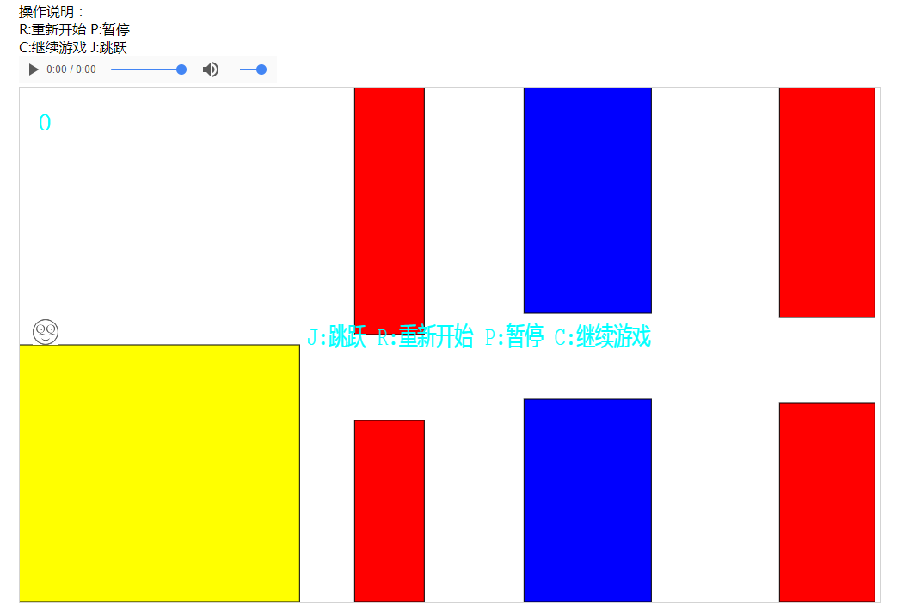

# 程序员快跑

纯原生JS，约500行代码的简单小游戏。

# 截图

# 代码摘要：

## baseDraw.js: 绘图的基类，提供绘制图片，文本，矩形的方法

## main.js：入口文件，初始化游戏

## Messager.js：显示消息，包含记分和屏幕中心的提示

## rectFactory.js：柱子矩形的生成和擦除，核心

## runnner.js：主角，重置，状态检查等

## sounder.js ：声音

## utils.js ：辅助类，复制和颜色随机
